# BusGo – Smart Bus Booking & AI Route Recommendation System

BusGo is a full-stack bus booking platform with a clean user interface, smart AI-powered route discovery, seat booking, payment flow, booking history, admin tools, and a knowledge-aware AI assistant.

It demonstrates a complete travel-booking journey from login to booking confirmation, along with a separate admin workflow for managing the platform — all enhanced with a production-grade AI layer built on top of Django, Ollama, LangChain, FAISS, and scikit-learn.

---

## ✨ Key Features

### Booking
- User registration and login
- Route search by source, destination, and date
- Seat selection and booking flow
- Payment integration via Razorpay
- My Bookings page to track and manage reservations
- Admin dashboard for managing buses, routes, schedules, users, and analytics
- Dark, responsive UI built for a polished demo experience

### AI & Machine Learning
- **Smart recommendation engine** — scores every bus across 5 dimensions (price, speed, comfort, seats, rating) and ranks results based on user preference mode
- **4 preference modes** — Best Overall, Cheapest, Fastest, Most Comfortable — with live re-ranking without page reload
- **LLM bullet-point reasoning** — Llama3 via Ollama generates a plain-English explanation per bus covering price, time, and comfort tradeoffs
- **Confidence scoring** — each result carries a 0–100% confidence badge based on data completeness and score spread
- **RAG knowledge-aware chatbot** — LangChain + FAISS + Ollama powers a grounded assistant that answers from real policy documents instead of hallucinating
- **ML price prediction** — RandomForest model predicts whether the current fare will rise or fall, with an urgency warning when booking now saves money

---

## 🤖 AI Architecture

```
User query / search
        │
        ▼
┌─────────────────────────────────────┐
│         Django AI Layer             │
│  ┌──────────────────────────────┐   │
│  │   RecommendView              │   │   ← /api/ai/recommend/
│  │   ScoreEngine (scoring.py)   │   │
│  │   LLM reasoning (llm_service)│   │
│  └──────────────────────────────┘   │
│  ┌──────────────────────────────┐   │
│  │   ChatView                   │   │   ← /api/ai/chat/
│  │   RAGService (rag_service.py)│   │
│  │   FAISS + LangChain + Ollama │   │
│  └──────────────────────────────┘   │
│  ┌──────────────────────────────┐   │
│  │   PricePredictView           │   │   ← /api/ai/predict-price/
│  │   RandomForest (.pkl model)  │   │
│  │   price_predictor.py         │   │
│  └──────────────────────────────┘   │
└─────────────────────────────────────┘
        │
        ▼
   MySQL (Bus, Route, Schedule, Booking)
```

### Scoring formula

```
score = (price_weight   × price_score)
      + (time_weight    × time_score)
      + (comfort_weight × comfort_score)
      + (seats_weight   × seat_score)
      + (rating_weight  × rating_score)
```

Weight profiles per preference mode:

| Mode      | Price | Time | Comfort | Seats | Rating |
|-----------|-------|------|---------|-------|--------|
| Balanced  | 0.20  | 0.25 | 0.25    | 0.10  | 0.20   |
| Cheapest  | 0.50  | 0.15 | 0.10    | 0.10  | 0.15   |
| Fastest   | 0.10  | 0.55 | 0.10    | 0.10  | 0.15   |
| Comfort   | 0.10  | 0.10 | 0.45    | 0.10  | 0.25   |

---

## 📸 Project Walkthrough

### 1) Landing Page
The user lands on the homepage and immediately sees the main booking form, popular routes, and the overall value of the platform.

### 2) Authentication
The user logs in using the login page to access booking features and personal booking history.

### 3) Search Journey
The user enters a source, destination, and travel date to search for available buses.

### 4) Search State
While the system is finding the best buses, a loading/searching view is shown to keep the experience clear.

### 5) Smart Search Results
The results page shows buses ranked by the AI recommendation engine. Each card displays:
- AI score breakdown (price, speed, comfort, seats, rating bars)
- LLM-generated bullet-point reasoning per bus
- Confidence badge (High / Medium / Low)
- Predicted price trend with urgency warning

### 6) No-Result Handling
If no buses are available for a route, the app shows a helpful empty state with suggestions and popular route shortcuts.

### 7) Seat Booking
The user opens the booking modal, enters passenger details, and selects a seat from the seat map.

### 8) Payment Flow
The booking proceeds through a secure payment experience powered by Razorpay.

### 9) Payment Success
After a successful payment, the user sees a confirmation screen with booking/payment details.

### 10) My Bookings
The user can view all active and past reservations in one place and manage upcoming trips.

### 11) BusGo AI Assistant
The RAG-powered chatbot answers questions grounded in real policy documents — cancellation rules, luggage policy, travel tips, and route information — with no hallucination.

### 12) Admin Login
The admin enters the protected dashboard using the admin login flow.

### 13) Admin Dashboard
The admin panel provides management tools, analytics, and an assistant for platform operations.

---

## 🖼️ Screenshot Gallery

> Put all screenshots inside the `README-assets/` folder.

### Home / Landing


### Login
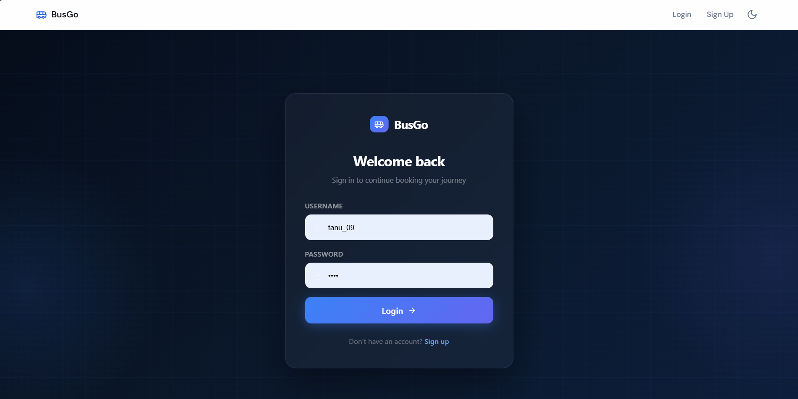

### Route Search
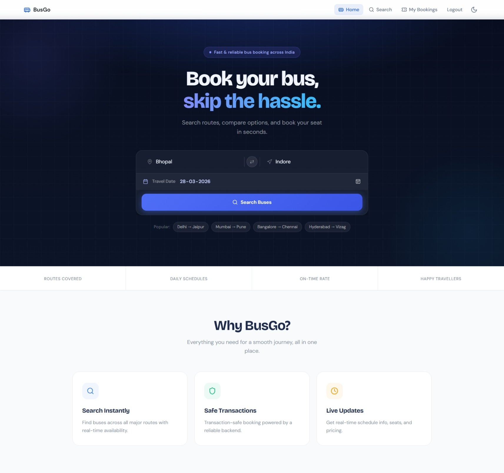
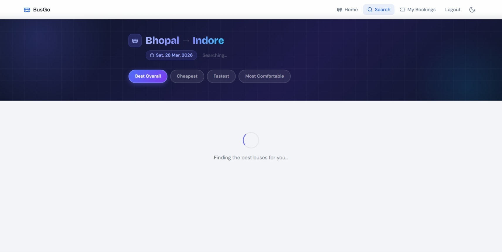
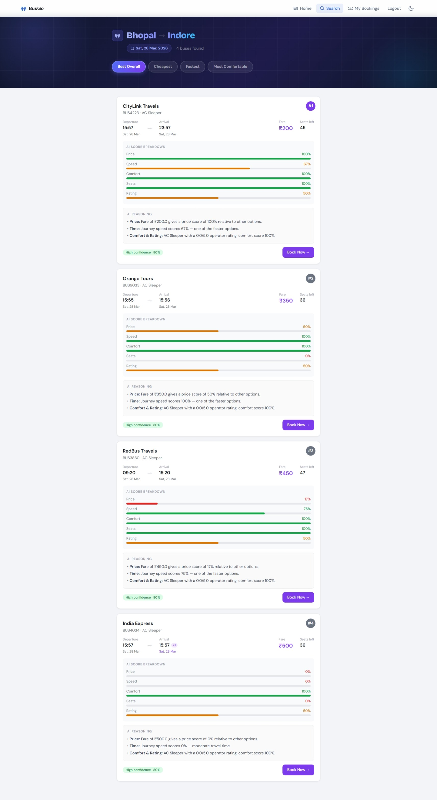
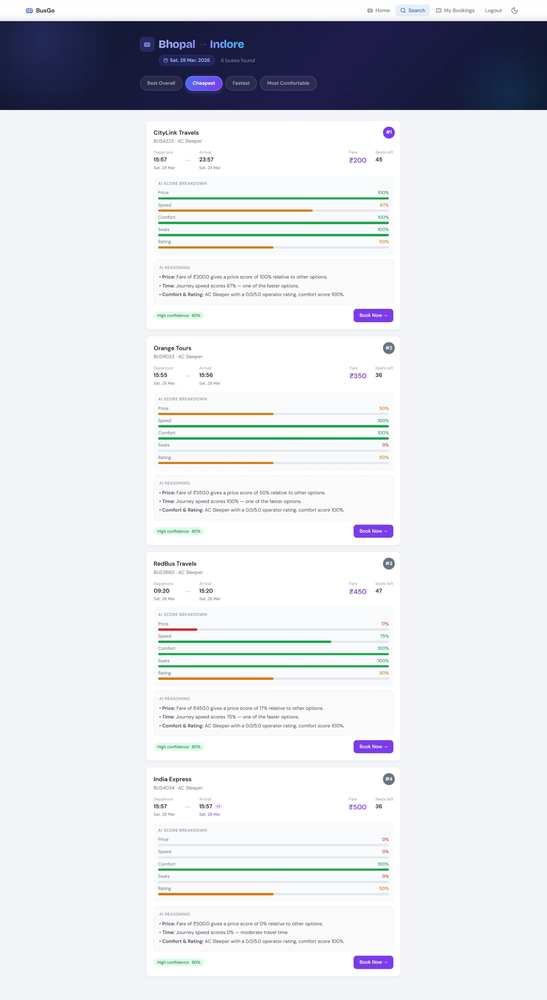
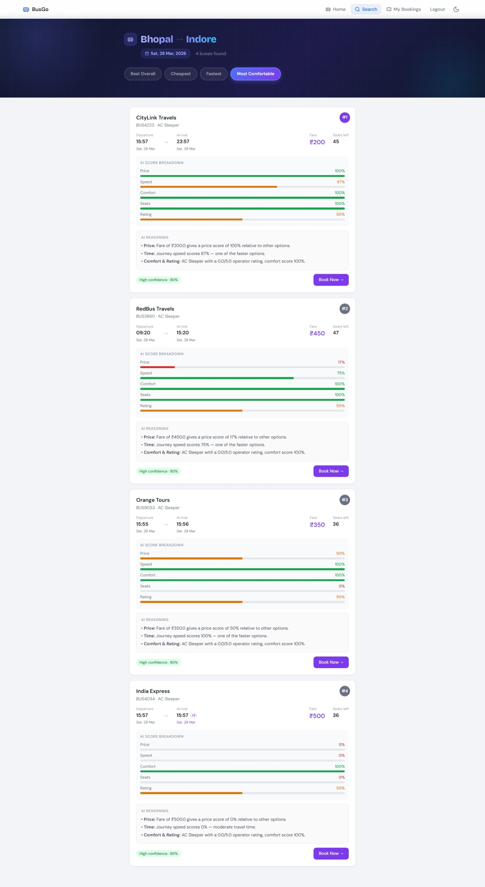
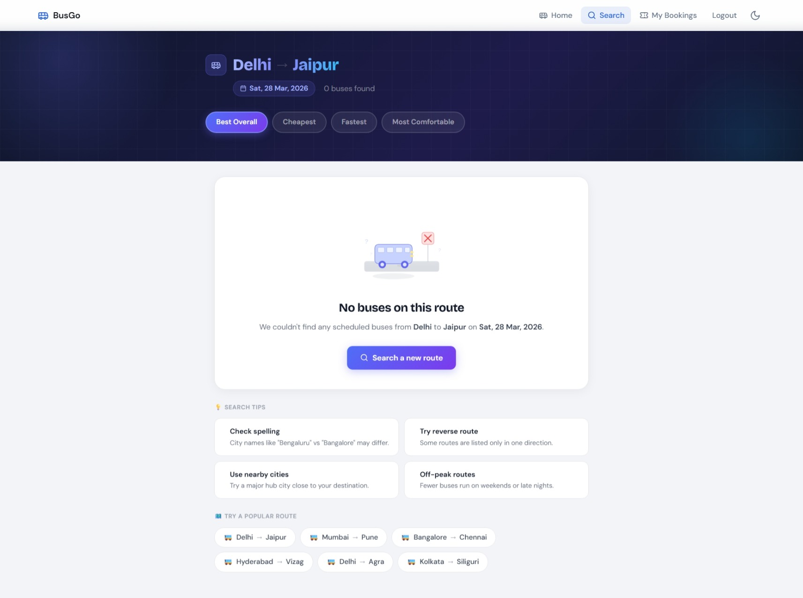

### Booking
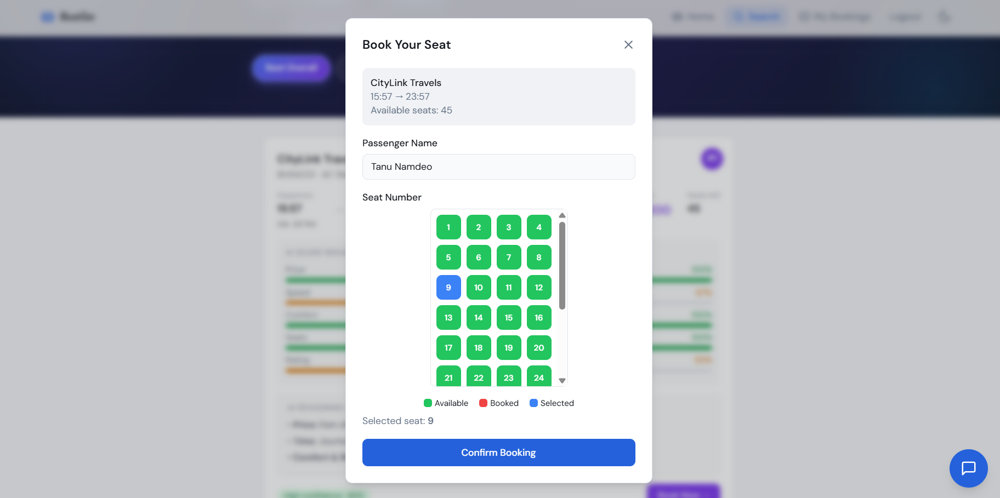

### Payment
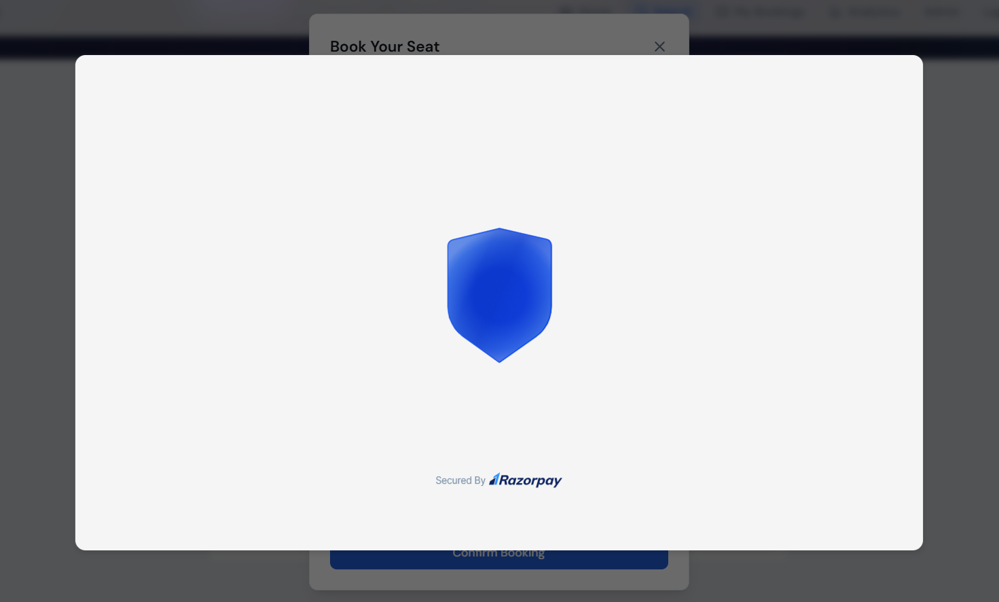
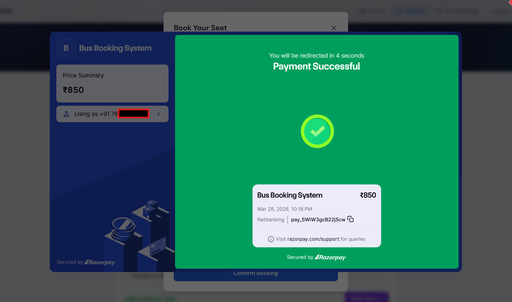

### My Bookings
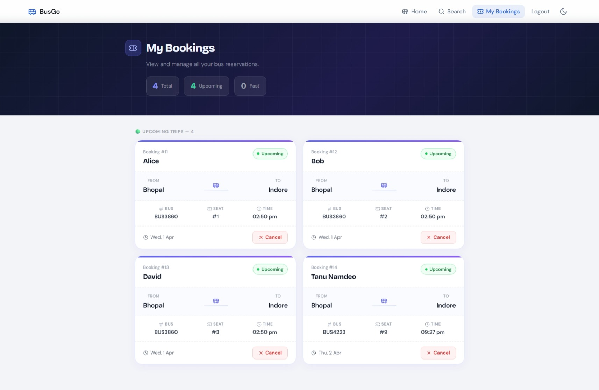

### Chatbot
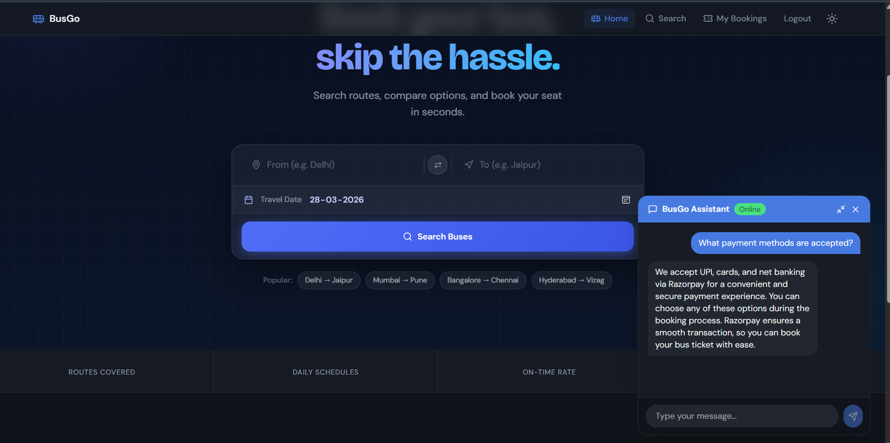

### Admin
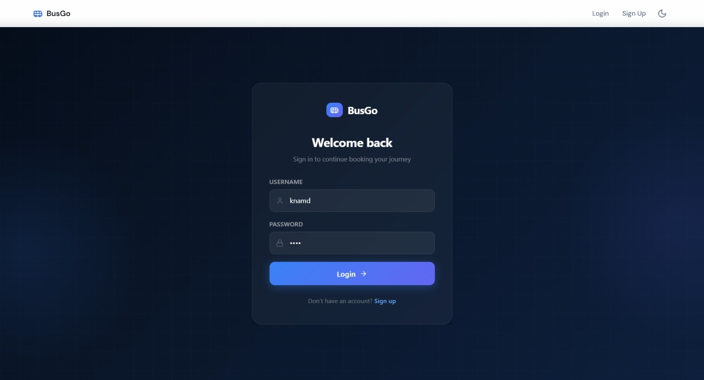
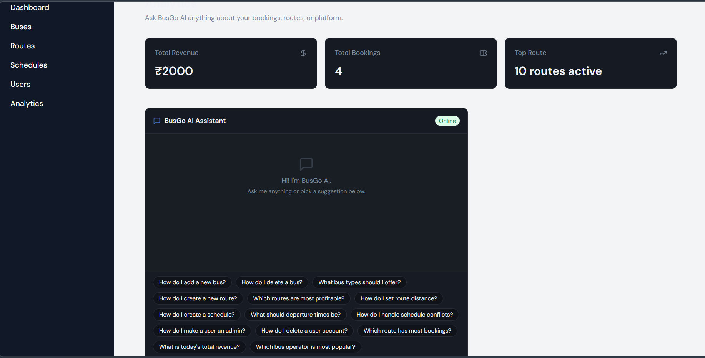

> If any filename changes, update the path here to match exactly.

---

## 🧰 Tech Stack

### Frontend
- React + Vite
- Tailwind CSS
- React Router
- Lucide React / UI icons

### Backend
- Django + Django REST Framework
- Python 3.13

### Database
- MySQL

### AI / ML
- **Ollama** — local LLM runtime (Llama3, tinyllama, nomic-embed-text)
- **LangChain + LangChain Community** — RAG orchestration
- **FAISS** — vector database for semantic search
- **scikit-learn** — RandomForest price prediction model
- **numpy** — feature engineering for ML pipeline

### Integrations
- Razorpay — payment flow
- httpx — async Ollama API calls

---

## 📁 Project Structure

```
BUSGO/
├── booking_service/
│   ├── ai/
│   │   ├── knowledge/              ← RAG knowledge base (.txt files)
│   │   │   ├── cancellation_policy.txt
│   │   │   ├── booking_rules.txt
│   │   │   ├── travel_tips.txt
│   │   │   └── route_information.txt
│   │   ├── scoring.py              ← 5-dimension scoring engine
│   │   ├── llm_service.py          ← Ollama async reasoning
│   │   ├── rag_service.py          ← LangChain + FAISS RAG pipeline
│   │   ├── price_predictor.py      ← RandomForest ML model
│   │   ├── views.py                ← RecommendView, ChatView, PricePredictView
│   │   └── urls.py
│   ├── bookings/
│   │   ├── models.py               ← Bus, Route, Schedule, Booking
│   │   ├── serializers.py
│   │   ├── views.py
│   │   └── urls.py
│   └── manage.py
├── frontend/
│   └── src/
│       ├── components/
│       │   ├── BusCard.tsx         ← AI scores, reasoning, price prediction
│       │   ├── UserChatbot.tsx     ← RAG-powered chat UI
│       │   └── ...
│       ├── pages/
│       │   ├── SearchResults.tsx   ← Preference picker + ranked results
│       │   └── ...
│       └── lib/
│           └── api.ts              ← fetchRecommendations()
├── README-assets/
├── README.md
├── .env.example
└── PROJECT_NOTES.md
```

---

## 🚀 How to Run the Project

### 1) Prerequisites

Make sure you have these installed:
- Python 3.10+
- Node.js 18+
- MySQL
- [Ollama](https://ollama.com) — for local LLM

### 2) Clone the repository

```bash
git clone <your-repo-url>
cd BusGo
```

### 3) Pull Ollama models

```bash
ollama pull tinyllama
ollama pull nomic-embed-text
```

### 4) Set up the backend

```bash
cd booking_service
python -m venv venv
venv\Scripts\activate        # Windows
# source venv/bin/activate   # Mac/Linux

pip install django djangorestframework mysqlclient httpx \
  langchain langchain-community langchain-ollama \
  langchain-text-splitters faiss-cpu \
  scikit-learn numpy
```

### 5) Configure environment variables

Create a `.env` file in `booking_service/` based on `.env.example`:

```env
DB_NAME=busgo_db
DB_USER=root
DB_PASSWORD=your_password
DB_HOST=localhost
DB_PORT=3306
```

### 6) Run migrations and start Django

```bash
python manage.py migrate
python manage.py runserver
```

### 7) Train the ML price model

```bash
python manage.py shell
```
```python
from ai.price_predictor import train_model
train_model()
```

### 8) Build the RAG index

The FAISS index builds automatically on first chat request.
To rebuild after updating knowledge files:

```bash
python manage.py shell
```
```python
from ai.rag_service import rebuild_index
rebuild_index()
```

### 9) Start the frontend

```bash
cd ../frontend
npm install
npm run dev
```

### 10) Open the app

```
http://localhost:5173
```

---

## ⚙️ Environment Variables

```env
DB_NAME=busgo_db
DB_USER=root
DB_PASSWORD=your_password
DB_HOST=localhost
DB_PORT=3306
RAZORPAY_KEY_ID=your_key_id
RAZORPAY_KEY_SECRET=your_key_secret
```

---

## 🧪 Demo Flow

1. Open the homepage
2. Log in as a user
3. Search a route (e.g. Bhopal → Indore)
4. Switch between **Best Overall / Cheapest / Fastest / Comfortable** — results re-rank live
5. Read the AI reasoning and confidence score on each card
6. Check the price prediction trend badge
7. Select a seat and complete payment
8. Check the booking in **My Bookings**
9. Try the chatbot — ask about cancellation policy or luggage rules
10. Log in as admin and manage the system

---

## 🔮 Future Improvements

- Live bus tracking
- Real-time seat availability sync
- Email/SMS booking notifications
- Preference memory — auto-select user's favourite mode
- Retrain price model automatically when new schedules are added
- Better analytics for admin dashboard
- Saved passenger profiles
- Llama3 streaming — reasons type out word by word

---

## 🙋 Notes

- Screenshots in this README are used to explain the flow of the application.
- Some data shown in screenshots may be sample/demo data used for presentation.
- Update file names and paths if you rename any screenshot.
- The AI features require Ollama running locally on port 11434.

---

## 👨‍💻 Author

Built by **Tanu Namdeo**
